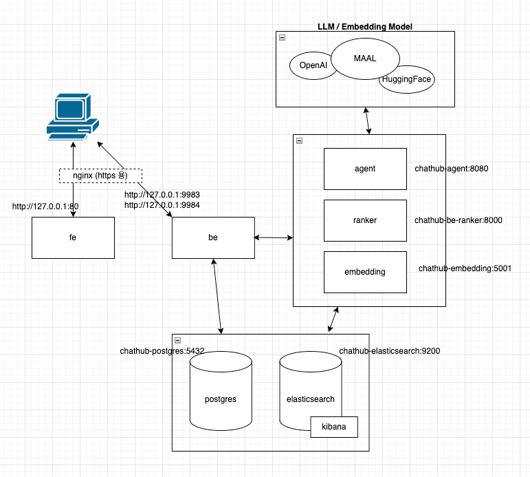

# Chathub 설치 & 실행

## 구성 모듈

### 챗허브
1. be (java/spring)
2. be-ranker (fastapi/python)
3. be-agent (grpc/python/langchain/langgraph)
4. embedding (flask/python)
5. fe (react/nginx)
### DB 및 기타
1. postgres
2. elasticsearch
3. kibana
4. nginx (https 통신 필요할 경우 선택)





## 환경
- 모든 모듈은 docker container 기반으로 동작
- 동일 docker network 으로 구성하여 컨테이너간 통신은 service-name

##  빌드 & 설치
- 각 소스 별로 빌드 & 도커 이미지 푸시 진행
  * 각 소스 폴더내에서 빌드 수행 (멀티플랫폼여부는 선택)
    * 일반  
    ```docker buildx build -t 이미지 --push . ```
    * 멀티플랫폼  
    ```docker buildx build --platform linux/amd64,linux/arm64 -t 이미지 --push . ```
- push 된 이미지를 docker-compose 를 이용하여 서버에 설치


- postgres docker 구동 및 backend 모듈 최초 실행시 초기 테이블과 데이터가 자동 생성 되지만 아래의 케이스 때문에 backend 구동이 실패될 수 있음
  * base_elastic 테이블에 등록된 elastic endpoint가 유효하지 않을 경우
  * cors_domains 에 frontend url이 등록되지 않았을 경우 fe -> backend api 호출 실패됨.
```
services:
  # DB - Postgres
  postgres:
    image: postgres:latest
    container_name: postgres
    environment:
      POSTGRES_USER: postgres  # 기본 사용자 설정
      POSTGRES_PASSWORD: mypassword  # 기본 비밀번호 설정
      POSTGRES_DB: postgres  # 기본 데이터베이스 설정
      TZ: Asia/Seoul
    networks:
      - onpre_network
    volumes:
      - ./postgres/init:/docker-entrypoint-initdb.d  # 초기화 스크립트가 저장된 경로 마운트
      - 데이터:/var/lib/postgresql/data  # 데이터 볼륨 마운트
    ports:
      - "25432:5432"

  # Vector Store - Elastic Search
  elasticsearch:
    image: docker.elastic.co/elasticsearch/elasticsearch:8.14.1
    container_name: elasticsearch
    environment:
      - node.name=elasticsearch
      - cluster.name=my-cluster
      - discovery.type=single-node
      - ELASTIC_PASSWORD=mypassword # 엘라스틱서치 기본 패스워드
      - bootstrap.memory_lock=true
      - xpack.security.enabled=true
      - xpack.license.self_generated.type=basic
      - TZ=Asia/Seoul
    mem_limit: 4g
    ulimits:
      memlock:
        soft: -1
        hard: -1
    ports:
      - "port:port"
      - "port:port"
    volumes:
      - 데이터:/usr/share/elasticsearch/data
    healthcheck:
      test: ["CMD-SHELL", "curl -s -u elastic:'mypassword' http://localhost:9200 | grep -q 'You Know, for Search'"]
      interval: 10s
      timeout: 10s
      retries: 120
    networks:
      - onpre_network

  # Kibana - Elastic Search
  kibana:
    image: docker.elastic.co/kibana/kibana:8.14.1
    container_name: kibana
    environment:
      - SERVERNAME=kibana
      - ELASTICSEARCH_HOSTS=http://elasticsearch:9200
      - ELASTICSEARCH_USERNAME=kibana_system
      - ELASTICSEARCH_PASSWORD=mypassword
      - XPACK_SECURITY_ENROLLMENT_ENABLED=false
      - TZ=Asia/Seoul
    mem_limit: 4g
    ports:
      - "5611:5601"
    volumes:
      - 데이터:/usr/share/kibana/data
    depends_on:
      elasticsearch:
        condition: service_healthy
    healthcheck:
      test: ["CMD-SHELL", "curl -s -I http://kibana:5601 | grep -q 'HTTP/1.1 302 Found'"]
      interval: 10s
      timeout: 10s
      retries: 120
    command: >
      sh -c "
      until curl -s -u elastic:'mypassword' http://elasticsearch:9200/_cluster/health | grep -E -q '\"status\":\"(green|yellow)\"'; do
        echo 'Waiting for Elasticsearch...';
        sleep 5;
      done &&
      echo 'Elasticsearch is ready. Changing kibana_system password...' &&
      curl -X POST -u elastic:'cotgjqm123!@#' http://elasticsearch:9200/_security/user/kibana_system/_password -H 'Content-Type: application/json' -d '{
        \"password\": \"mypassword\"
      }' &&
      echo 'Starting Kibana...' &&
      /usr/share/kibana/bin/kibana"
    networks:
      - onpre_network
  # Backend-API
  be:
    container_name: be
    image: 이미지
    networks:
      - onpre_network
    ports:
      - "9983:9993"
      - "9984:9994"
    environment:
      - ENV=docker
      - JASYPT_ENCRYPTOR_PASSWORD=jasypt_password
      - TZ=Asia/Seoul
      - JAVA_OPTS=-Duser.timezone=Asia/Seoul
      - WEATHER_LONGITUDE=127.356486176474F   #대전유성구-한국기계원
      - WEATHER_LATITUDE=36.3965827395F       #대전유성구-한국기계원
    volumes:
      - 데이터:/data  # 호스트의 /data 폴더를 컨테이너의 /data 폴더에 마운트
    depends_on:
      - postgres

  # Ranker
  be-ranker:
    container_name: be-ranker
    image: 이미지
    networks:
      - onpre_network
    ports:
      - "8000:8000"
    environment:
      ENV: docker  # 실행 시 환경 변수로 설정
      TZ: Asia/Seoul
      OPENAI_API_KEY: sk-....... # OpenAI API KEY

    volumes:
      - 데이터:/app/embedding_models
      - 데이터:/data
    depends_on:
      - chathub-postgres

  # Rag Search API
  agent:
    container_name: 데이터agent
    image: 이미지
    networks:
      - onpre_network
    ports:
      - "8080:8080"  # 외부 5000번 포트를 컨테이너 5000번 포트에 연결
    environment:
      ENV: docker  # 환경 변수 설정
      TZ: Asia/Seoul
    depends_on:
      - postgres

  # Embedding Agent
  embedding:
    container_name: embedding
    image: 이미지
    ports:
      - "5001:5001"
    depends_on:
      - elasticsearch
      - postgres
    environment:
      - ENV=docker
      - CONFIG_PATH=/workplace/cfg/docker_cfg.yaml
      - PORT=5001
      - TZ=Asia/Seoul
      - OPENAI_API_KEY=sk-....... # OpenAI API KEY
    volumes:
      - 데이터:/data
    networks:
      - onpre_network

  # Front
  fe:
    container_name: fe
    image: 이미지
    environment:
      - TZ=Asia/Seoul
    ports:
      - "81:80"
    networks:
      - onpre_network

networks:
  네트워크:                    # 챗허브용 도커 네트워크
    name: 네트워크
```

